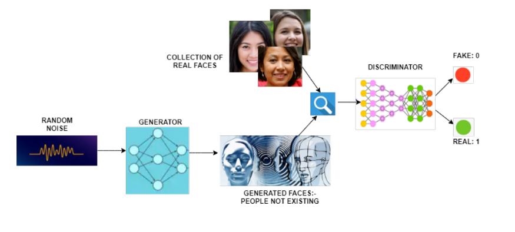

# DCGAN CelebA

A Deep Convolutional General Adversarial Network (DCGAN) to generate fake faces based on CelebA dataset https://mmlab.ie.cuhk.edu.hk/projects/CelebA.html
<!--  -->

### Platform: Tensorflow - Keras

### Dataset example
<!--  -->

### Required packaages:
- tensorflow
- tensorflow_datasets
- matplotlib

### Instructions
- Run `python DCGAN.py`
- Note: The default dataset path is `D:/tensorflow_datasets`. You can change it depending on your system.

### Results
<!--  -->

